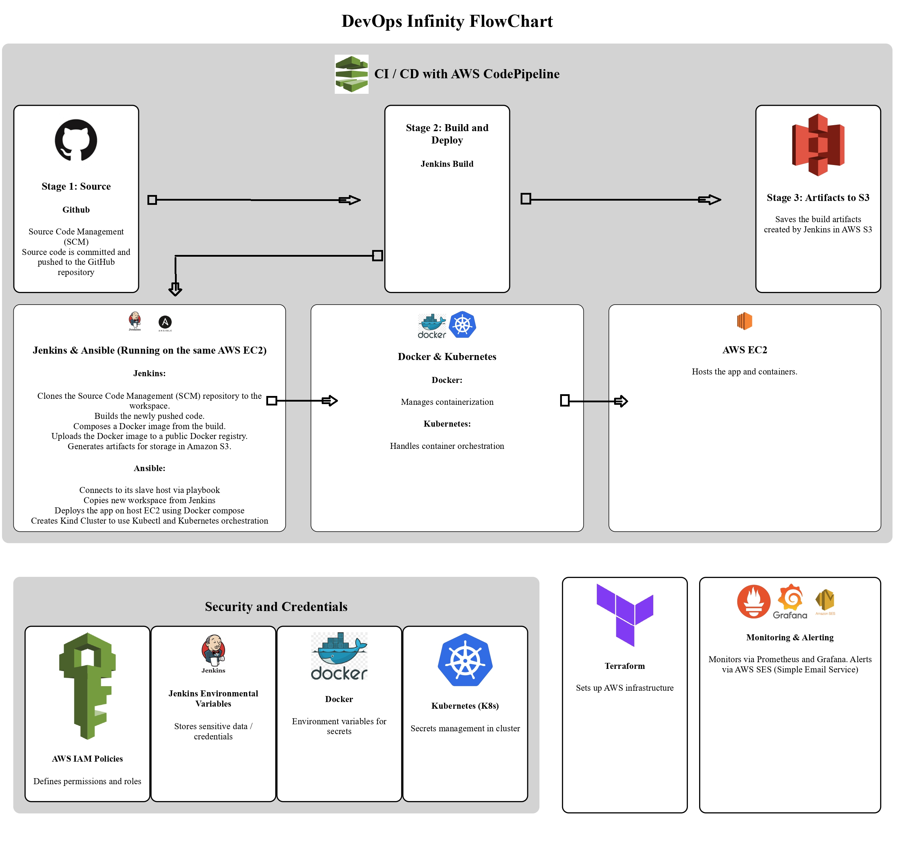
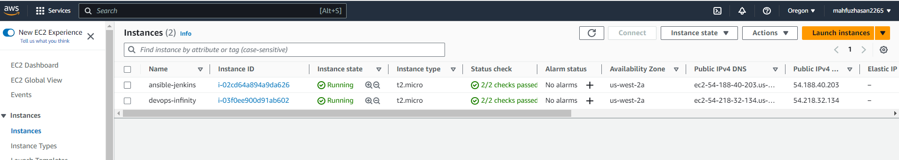
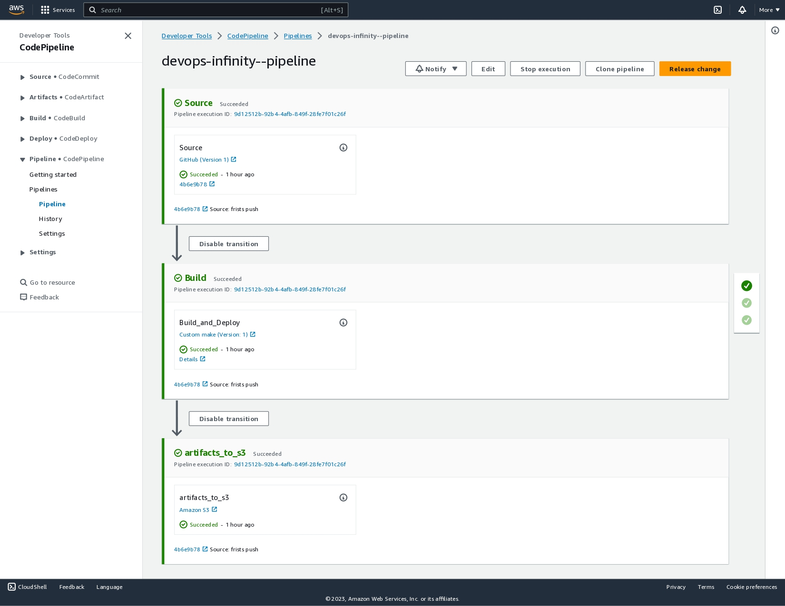
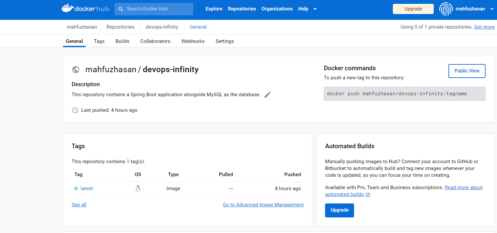
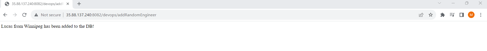
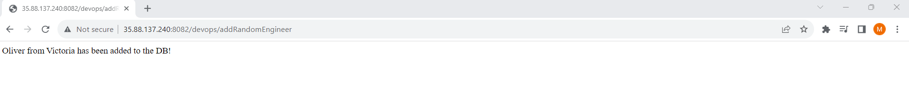
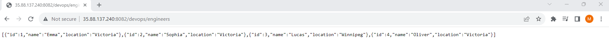
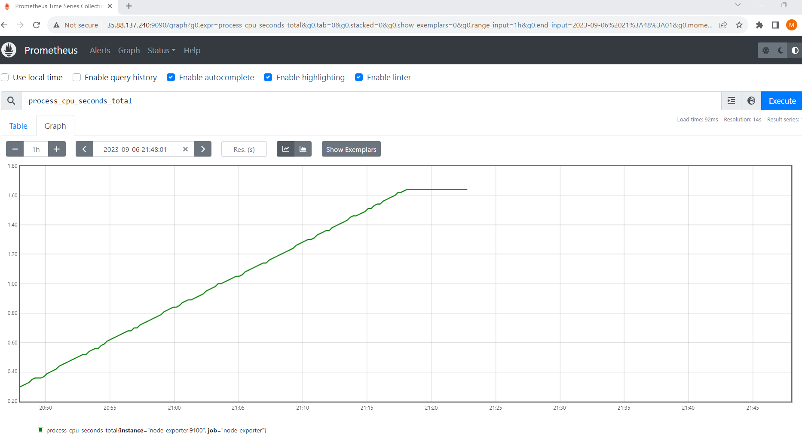
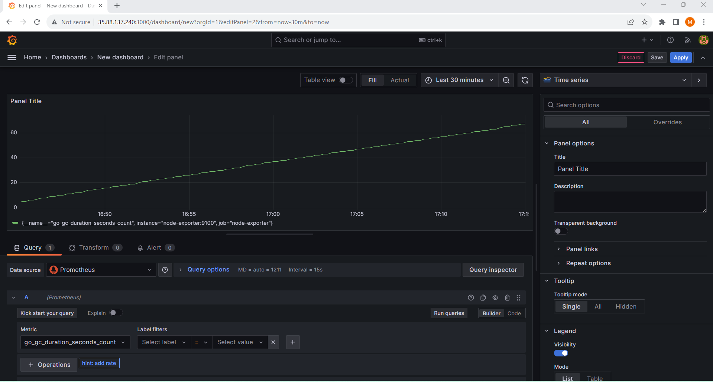

# DevOps Infinity: A Comprehensive DevOps Pipeline

## Objective
Implemented a full-stack DevOps project focused on creating a comprehensive automation cycle for a Spring Boot application. The project integrates DevOps best practices and features end-to-end CI/CD automation, container orchestration, real-time monitoring, and alerting, all deployed on a Kubernetes cluster.
## Technologies
Built using **Spring Boot**, **Docker**, **Kubernetes**, **Jenkins**, **Ansible**, **Prometheus**, **Grafana**, and **Terraform**. Additionally, various **AWS services** were utilized, including **EC2**, **CodePipeline**, **SES**, **IAM**, and **S3**..
## Development, Containerization & Orchestration
- Initialized a Spring Boot microservice with CRUD APIs and MySQL database integration.
- Successfully containerized the service using Docker.
- Conducted local testing through Docker Compose.
- Orchestrated the application using Kubernetes for automated scaling and high availability.

## Infrastructure Provisioning
- Initiated infrastructure-as-code practices using Terraform.
- Authored Terraform code to set up and configure AWS services like EC2 and SES.

## Deployment & CI/CD
- Integrated GitHub and Jenkins into AWS CodePipeline and AWS S3.
- Jenkins pushes Docker images to a public registry.
- Built artifacts are stored in AWS S3, completing the AWS CodePipeline process.
- In the post-build stage, Ansible deploys the application to a target EC2 instance using Docker Compose.
- Sets up a Kind Cluster for Kubernetes orchestration, managed via kubectl.

## Security
- Utilized AWS IAM to define roles and permissions for various AWS services.
- Safeguarded sensitive data and credentials using Jenkins environment variables.
- Implemented Docker environment variables for confidential information.
- In Kubernetes, managed secrets by creating YAML files and used config maps within the cluster for added security.

## Monitoring & Alerting
- Set up Prometheus for data collection.
- Configured Grafana for dashboard visualization.
- Alertmanager is configured to monitor CPU and memory usage.
- AWS Simple Email Service is set to send out alert emails when thresholds are exceeded.


## CI/CD Pipeline Overview

## Devops_Infinity - Spring Boot Application
This Spring Boot application serves as a backend REST API web app that can POST and retrieve data. The application is dockerized and designed to connect to a MySQL database.
The application and its services (MySQL database, Alertmanager, Prometheus, Grafana, and Node-Exporter) are containerized using Docker Compose.

## API Endpoints

### Add Random Engineer

- **Endpoint**: `http://localhost:8082/devops/addRandomEngineer`
- **Type**: GET (Acts as POST due to application logic)
- **Description**: Adds a random engineer to the MySQL database.

#### Implementation in `controller/DevOpsController.java`

```java
@GetMapping("/addRandomEngineer")
public String addRandomEngineer() {
    DevOpsEngineer engineer = new DevOpsEngineer();
    engineer.setName(names.get(random.nextInt(names.size())));
    engineer.setLocation(locations.get(random.nextInt(locations.size())));
    repository.save(engineer);
    return engineer.getName() + " from " + engineer.getLocation() + " has been added to the DB!";
}
```
### Retrieve All Engineers

- **Endpoint**: `http://localhost:8082/devops/engineers`
- **Type**: GET
- **Description**: Fetches all the engineers stored in the MySQL database.

#### Implementation in `controller/DevOpsController.java`
```java
@GetMapping("/engineers")
public List<DevOpsEngineer> getAllEngineers() {
    return repository.findAll();
}
```
# docker-compose.yml Overview

## Services

### Webapp

This service runs  Spring Boot application. It's built from a Dockerfile and exposes port 8082.

```yaml
webapp:
  build:
    context: .
    dockerfile: Dockerfile
  image: spring-boot-devops-infinity:latest
  ports:
    - "8082:8082"
  environment:
    SPRING_DATASOURCE_URL: ${SPRING_DATASOURCE_URL}
    SPRING_DATASOURCE_USERNAME: ${SPRING_DATASOURCE_USERNAME}
    SPRING_DATASOURCE_PASSWORD: ${SPRING_DATASOURCE_PASSWORD}
```
### DB (MySQL)

This service uses a MySQL 5.7 image to run the database component of the application. Several environment variables are specified for configuring MySQL. The service also uses Docker volumes to persist database data and to initialize the database with necessary tables.

The initialization script in the `./mysql-init/01-init.sql` file automatically creates the necessary database and table.

```yaml
db:
  image: mysql:5.7
  environment:
    MYSQL_ROOT_PASSWORD: ${MYSQL_ROOT_PASSWORD}
    MYSQL_DATABASE: ${MYSQL_DATABASE}
    MYSQL_USER: ${MYSQL_USER}
    MYSQL_PASSWORD: ${MYSQL_PASSWORD}
  volumes:
    - db-data:/var/lib/mysql
    - ./mysql-init:/docker-entrypoint-initdb.d
```
### Prometheus

This service uses the latest Prometheus image for monitoring and alerting. Prometheus collects metrics from configured targets at given intervals, evaluates rule expressions, displays the results, and can trigger alerts when specified conditions are observed. It exposes port 9090 for web UI access.

```yaml
prometheus:
  image: prom/prometheus:latest
  volumes:
    - ./prometheus.yml:/etc/prometheus/prometheus.yml
  ports:
    - "9090:9090"
```


### Grafana

This service uses the Grafana image for metrics visualization. It is essential for visualizing data and creating dashboards. Grafana service exposes port 3000 for web UI access.

```yaml
grafana:
  image: grafana/grafana
  ports:
    - "3000:3000"
```

### Node-Exporter

This service uses the latest Node-Exporter image to collect machine metrics. The service exposes port 9100.

```yaml
node-exporter:
  image: prom/node-exporter:latest
  ports:
    - "9100:9100"
```
### Alertmanager

Alertmanager is responsible for handling alerts sent by Prometheus server. It takes care of deduplicating, grouping, and routing them to the correct receiver integration such as email, PagerDuty, or OpsGenie. It exposes port 9093 for alerting and status access.

```yaml
alertmanager:
  image: prom/alertmanager:latest

## Kubernetes Configuration YML Overview
  ports:
    - "9093:9093"
  volumes:
    - ./alertmanager.yml:/etc/alertmanager/alertmanager.yml
```
## Kubernetes Configuration YML Overview
## MySQL Kubernetes Configuration

### mysql-deployment.yml

The `mysql-deployment.yml` file contains Kubernetes configurations for setting up a MySQL database in  cluster. It includes a `ConfigMap` for environment variables, a `Deployment` for running the MySQL container, and a `Service` for exposing the MySQL database.

### ConfigMap

This configuration map is used to store the MySQL database name and user.

```yaml
apiVersion: v1
kind: ConfigMap
metadata:
  name: mysql-config
data:
  MYSQL_DATABASE: "devops_db"
  MYSQL_USER: "mahfuz"
```

### MySQL Deployment Configuration

#### Overview

The `Deployment` configuration sets up a single replica of the MySQL database, pulling from the MySQL 5.7 image. It specifies environment variables using both a ConfigMap and Secrets.

#### Deployment 
- `replicas: 1`: Specifies that only one instance of the MySQL container will be running.
- `image: mysql:5.7`: Uses MySQL version 5.7.
- `env`: Defines environment variables from Secrets (`mysql-secret`) and ConfigMap (`mysql-config`).
- `containerPort: 3306`: Exposes the MySQL database at port 3306 within the container.

```yaml
apiVersion: apps/v1
kind: Deployment
metadata:
  name: mysql
spec:
  replicas: 1
  selector:
    matchLabels:
      app: mysql
  template:
    metadata:
      labels:
        app: mysql
    spec:
      containers:
        - name: mysql
          image: mysql:5.7
          env:
            - name: MYSQL_ROOT_PASSWORD
              valueFrom:
                secretKeyRef:
                  name: mysql-secret
                  key: MYSQL_ROOT_PASSWORD
            - name: MYSQL_DATABASE
              valueFrom:
                configMapKeyRef:
                  name: mysql-config
                  key: MYSQL_DATABASE
            - name: MYSQL_USER
              valueFrom:
                configMapKeyRef:
                  name: mysql-config
                  key: MYSQL_USER
            - name: MYSQL_PASSWORD
              valueFrom:
                secretKeyRef:
                  name: mysql-secret
                  key: MYSQL_PASSWORD
          ports:
            - containerPort: 3306
```
#### Service 

- `metadata.name: mysql`: Defines the name of the service as `mysql`.
- `selector.app: mysql`: Maps the service to pods with the label `app: mysql`.
- `protocol: TCP`: Specifies that the service will use the TCP protocol.
- `port: 3306`: Exposes the MySQL service on port 3306.
```yaml
apiVersion: v1
kind: Service
metadata:
  name: mysql
spec:
  selector:
    app: mysql
  ports:
    - protocol: TCP
      port: 3306
```
# Kubernetes Configuration for Prometheus and Alertmanager
## prometheus.yml
- `scrape_interval`: 15s: Sets the time interval between metric scrapes.
- `job_name`: Specifies the jobs 'spring-boot' and 'node-exporter' for metric collection.
- `alerting`: Configures alerts to be sent to Alertmanager.
```yaml
global:
  scrape_interval: 15s
scrape_configs:
  - job_name: 'spring-boot'
    metrics_path: '/actuator/prometheus'
    static_configs:
    - targets: ['webapp:8082']
  - job_name: 'node-exporter'
    static_configs:
    - targets: ['node-exporter:9100']
rule_files:
  - "rules.yml"
alerting:
  alertmanagers:
  - static_configs:
    - targets: ['alertmanager:9093']
```
## Prometheus Rules / rules.yml

Prometheus rules are defined in a separate YML file that Prometheus reads to apply specific alert conditions.

- `alert`: HighCPU: This defines an alert named "HighCPU".
- `expr`: Specifies the expression that triggers the alert. Here, it will trigger when CPU usage is above 90%.
- `labels and annotations`: Provides additional metadata and information about the alert. The severity: "critical" label indicates that this alert is critical, and the annotation provides a summary.

```yaml
groups:
- name: example
  rules:
  - alert: HighCPU
    expr: 100 - (avg(irate(node_cpu_seconds_total{mode="idle"}[5m])) by (instance) * 100) > 90
    labels:
      severity: "critical"
    annotations:
      summary: "High CPU Usage"
```
## alertmanager.yml

Alertmanager handles the alerts generated by Prometheus, routing them according to configuration. 
- `global`: Contains settings that apply globally to Alertmanager, including SMTP configurations for email alerts.
- `route`: Defines how incoming alerts are grouped and where they should be sent.
- `group_by`: Specifies how the alerts are grouped. Here, they are grouped by the 'job' and 'severity' labels.
- `routes`: Specifies the conditions that must be met for alerts to be sent to a particular receiver.
- `receivers`: Contains the configuration for where to send alerts. Here, the receiver named 'email-me' is configured to send email alerts.
```yaml
apiVersion: v1
kind: ConfigMap
metadata:
  name: alertmanager-config
data:
  alertmanager.yml: |
    global:
      smtp_smarthost: 'email-smtp.us-west-2.amazonaws.com:587'
      smtp_from: 'mahfuzhasan@email.com'
      smtp_auth_username: '${SMTP_AUTH_USERNAME}'
      smtp_auth_password: "${SMTP_AUTH_PASSWORD}"
    route:
      group_by: ['job', 'severity']
      routes:
        - match:
            severity: 'critical'
          receiver: 'email-me'
    receivers:
      - name: 'email-me'
        email_configs:
          - to: 'mahfuzhasan@email.com'
            auth_username: "${SMTP_AUTH_USERNAME}"
            auth_identity: "${SMTP_AUTH_IDENTITY}"
            auth_password: "${SMTP_AUTH_PASSWORD}"
```
## spring-boot-deployment.yml

In Kubernetes setup, `spring-boot-deployment.yml` serves as the primary configuration file and acts as the entry point for deploying the Spring Boot application into the Kubernetes cluster.

### Spring Boot Deployment YAML Highlights

- `replicas: 1`: Specifies that only one instance of the Spring Boot container will be running.
- `image: spring-boot-devops-infinity:latest`: Utilizes the latest version of the custom Spring Boot Docker image.
- `containerPort:`: Exposes the Spring Boot application at port 8082 within the container.
- `env`: Sets up environment variables that the Spring Boot application uses for various configurations like database connection.
```yaml
apiVersion: apps/v1
kind: Deployment
metadata:
  name: spring-boot-devops
spec:
  replicas: 1
  selector:
    matchLabels:
      app: spring-boot-devops
  template:
    metadata:
      labels:
        app: spring-boot-devops
    spec:
      containers:
        - name: spring-boot-devops
          image: spring-boot-devops-infinity:latest
          ports:
            - containerPort: 8082
          env:
            - name: SPRING_DATASOURCE_URL
              value: "jdbc:mysql://mysql:3306/devops_db"
            - name: SPRING_DATASOURCE_USERNAME
              valueFrom:
                secretKeyRef:
                  name: db-credentials
                  key: db-username
            - name: SPRING_DATASOURCE_PASSWORD
              valueFrom:
                secretKeyRef:
                  name: db-credentials
                  key: db-password
```
## Terraform Configuration for AWS Services

This Terraform code is used for setting up various AWS services including AWS EC2 and SES.

### Main Terraform File: main.tf

#### AWS EC2 & SES (Simple Email Service)  Setup

```hcl
variable "aws_access_key" {}
variable "aws_secret_key" {}

provider "aws" {
  region     = "us-west-2"
  access_key = var.aws_access_key
  secret_key = var.aws_secret_key
}

resource "aws_security_group" "allow_ssh" {
  name        = "allow_ssh_and_other_ports"
  description = "Allow SSH and other ports"
  
  dynamic "ingress" {
    for_each = [8080, 8082, 3306, 9090, 9093, 3000, 9100]
    content {
      from_port   = ingress.value
      to_port     = ingress.value
      protocol    = "tcp"
      cidr_blocks = ["0.0.0.0/0"]
    }
  }  
}

resource "aws_instance" "ansible_jenkins" {
  ami  = "ami-03f65b8614a860c29"  # Ubuntu Server 22.04 LTS, checked it is available with free tier for us-west-2
  instance_type = "t2.micro"
  vpc_security_group_ids = [aws_security_group.allow_ssh.id]

  tags = {
    Name = "ansible-jenkins"
  }
}

resource "aws_instance" "devops_infinity" {
  ami  = "ami-03f65b8614a860c29"  # Ubuntu Server 22.04 LTS, checked it is available with free tier for us-west-2
  instance_type = "t2.micro"
  vpc_security_group_ids = [aws_security_group.allow_ssh.id]

  tags = {
    Name = "devops-infinity"
  }
resource "aws_ses_email_identity" "devops_infinity" {
  email = "mahfuzhasan@email.com"
}
}
```


#### Ansible Jenkins Server

- **AMI:** Ubuntu Server 22.04 LTS
- **Instance Type:** t2.micro
- **Security Group:** allow_ssh_and_other_ports
- **Tags:** Name = ansible-jenkins

#### DevOps Infinity Server

- **AMI:** Ubuntu Server 22.04 LTS
- **Instance Type:** t2.micro
- **Security Group:** allow_ssh_and_other_ports
- **Tags:** Name = devops-infinity

### Security Group

- **Name:** allow_ssh_and_other_ports
- **Description:** Allow SSH and other ports

### Security Group Configuration

The security group named `allow_ssh_and_other_ports` has been configured to allow incoming traffic on the following ports, along with their corresponding services:

- **SSH (22):** Secure Shell access for server administration.
- **Jenkins (8080):** Jenkins CI/CD server for automation and continuous integration.
- **Spring Boot App (8082):** REST API endpoint for the Spring Boot application.
- **MySQL (3306):** MySQL database for storing application data.
- **Prometheus (9090):** Prometheus monitoring and alerting tool for metrics collection.
- **Alertmanager (9093):** Alertmanager for managing and routing alerts from Prometheus.
- **Grafana (3000):** Grafana for visualizing and monitoring data from Prometheus.
- **Node-exporter (9100):** Node Exporter for exporting system metrics for Prometheus.

This security group allows incoming traffic on these ports from any IP address, enabling access to the necessary services for  DevOps infrastructure.


## jenkins-ansible EC2 Server
### Jenkins Setup

1. **Jenkins Installation:** Jenkins is installed on the Ansible Jenkins server.
2. **Plugins:** The AWS CodePipeline plugin is installed in Jenkins.
3. **Integration:** Jenkins is integrated with AWS CodePipeline for continuous integration and deployment. AWS and Docker Hub credentials have also been added to facilitate interactions with these services.

### Ansible Configuration

Ansible is set up as the master on the Ansible Jenkins server. It can be used to configure and manage other servers.

### Development Tools

The following development tools are installed on the Ansible-Jenkins server:

- **JDK 11:** Java Development Kit 11
- **Maven:** Build automation and project management tool
- **Docker:** Containerization platform
- **Docker Compose:** Tool for defining and running multi-container Docker applications
- **Jenkins Job:** Pipeline for building and deploying code
- **Ansible:** Configuration management and automation tool

## devops-infinity EC2 Server

The following tools are installed on the DevOps Infinity server:

- **JDK 11:** Java Development Kit 11
- **Maven:** Build automation and project management tool
- **Ansible:** Configuration management and automation tool
- **Docker:** Containerization platform
- **Docker Compose:** Tool for defining and running multi-container Docker applications
- **KIND Cluster:** Kubernetes IN Docker for local development and testing
- **kubectl:** Kubernetes command-line tool

# DevOps Infinity AWS CodePipeline Setup

This repository contains the setup and configuration details for the AWS CodePipeline named "devops-infinity-pipeline" used in the DevOps Infinity project.

## AWS CodePipeline Overview

### Pipeline Stages

The "devops-infinity-pipeline" AWS CodePipeline consists of the following stages:

#### Stage 1: Source Code Integration

- **Source:** GitHub Repository "devops-infinity"
- **Action:** This stage is responsible for fetching the latest changes from the GitHub repository whenever new commits are pushed. It serves as the trigger for the pipeline.

#### Stage 2: Build and Deploy

- **Action:** Integration with Jenkins CI/CD Server
- **Description:** This stage is responsible for the build and deployment of  application. It connects to the Jenkins CI/CD server to automate the build and deployment process. Any code changes pushed to the GitHub repository trigger this stage.

#### Stage 3: Artifact Storage

- **Action:** AWS S3 Bucket (Created alongside the AWS CodePipeline)
- **Description:** This stage saves the build artifacts produced in Stage 2 to an AWS S3 bucket. Storing artifacts in S3 allows for easy retrieval and sharing of build outputs.

## GitHub Repository

The source code for the DevOps Infinity project is hosted in the GitHub repository named "devops-infinity." Commits pushed to this repository trigger the AWS CodePipeline for automated continuous integration and deployment.

## Pipeline Execution

As you can see in the screenshot below, the AWS CodePipeline "devops-infinity-pipeline" has been triggered successfully after  first commit to the GitHub repository. This pipeline automates the entire CI/CD process, from source code integration to artifact storage.

# DevOps Infinity AWS CodePipeline - Build and Deploy Stage

## Jenkins Configuration

### Jenkins Pipeline Overview

The Jenkins pipeline is configured to perform the following tasks:

1. **Checkout**: Clones the Source Code Management (SCM) repository to the workspace.

2. **Build & Test**: Compiles and tests the codebase.

3. **Archive Artifacts**: Archives build artifacts for storage in Amazon S3.

4. **Docker Compose Build**: Builds a Docker image from the code.

5. **Docker Compose Up**: Deploys the application using Docker Compose.

6. **Push Docker Image**: Pushes the Docker image to a public Docker registry.

7.  **Ansible**: running on the same server as Jenkins, plays an Ansible playbook to deploy the application on the host server.

8.  **Docker Compose Down** :Shuts down the Docker containers using Docker Compose.
### Jenkinsfile
```groovy
pipeline {
    agent any

    parameters {
        string(name: 'DOCKER_REGISTRY', defaultValue: 'mahfuzhasan/devops-infinity', description: 'Docker registry')
    }

    environment {
        DOCKER_REGISTRY = "${params.DOCKER_REGISTRY}"
        JAVA_HOME = '/usr/lib/jvm/java-11-openjdk-amd64'
        MAVEN_HOME = '/usr/share/maven'
    }

    stages {
        stage('Checkout') {
            steps {
                retry(3) {
                    checkout scm
                }
            }
        }

        stage('Build & Test') {
            steps {
                script {
                    retry(3) {
                        sh "mvn clean install"
                    }
                }
            }
        }
        stage('Archive Artifacts') {
            steps {
                archiveArtifacts artifacts: 'target/*.jar', allowEmptyArchive: true

            }
        }
        stage('Docker Compose Build') {
            when {
                expression { currentBuild.resultIsBetterOrEqualTo('SUCCESS') }
            }
            steps {
                script {
                    retry(3) {
                        sh "docker-compose build"
                    }
                }
            }
        }
        stage('Docker Compose Up') {
            when {
                expression { currentBuild.resultIsBetterOrEqualTo('SUCCESS') }
            }
            steps {
                script {
                    retry(3) {
                        sh "docker-compose up -d"
                    }
                }
            }
        }
        stage('Push Docker Image') {
            when {
                expression { currentBuild.resultIsBetterOrEqualTo('SUCCESS') }
            }
            steps {
                script {
                    withDockerRegistry([credentialsId: 'dockerHubCredentials', url: '']) {  // Replace with your Docker Hub credentials ID
                        def tag = env.BRANCH_NAME.replaceAll('/', '-')
                        retry(3) {
                            sh "docker push ${DOCKER_REGISTRY}:${tag}"
                        }
                    }
                }
            }
        }
        stage('Deploy with Ansible') {
            when {
                expression { currentBuild.resultIsBetterOrEqualTo('SUCCESS') }
            }
            steps {
                script {
                    withCredentials([usernamePassword(credentialsId: 'myCreds', usernameVariable: 'USER', passwordVariable: 'PASS')]) {
                        def tag = env.BRANCH_NAME.replaceAll('/', '-')
                        retry(3) {
                            sh "ansible-playbook -i inventory.ini deploy_app.yml --extra-vars 'jenkins_workspace=${WORKSPACE}'"
                        }
                        echo "Deploying the ${tag} branch using Ansible."
                    }
                }
            }
        }
    }

    post {
        always {
            sh "docker-compose down"
        }
    }
}
```
 The screenshot  below of is public the Docker Hub registry, where Jenkins pushes Docker images during the CI/CD process. 
 

# DevOps Infinity Ansible Playbook - deploy_app.yml


## Ansible Playbook Overview

The `deploy_app.yml` Ansible playbook is responsible for automating several tasks to deploy the DevOps Infinity application. 

### 1. Connect to Slave Host

- **Task:** Ansible connects to its slave host, which is the target EC2 instance, via this playbook.
- **Target Host:** EC2 instance running the application.

### 2. Copy Workspace

- **Task:** Copies the new Jenkins workspace files to a directory named "devops-infinity" on the target host.
- **Purpose:** This step ensures that the most recent build artifacts and application code are available for deployment.

### 3. Create Kind Cluster

- **Task:** Sets up a Kind Cluster on the host EC2 instance.
- **Purpose:** Creating a Kind Cluster provides a Kubernetes environment for managing and orchestrating the application.

### 4. Deploy the App

- **Task:** Deploys the DevOps Infinity application on the host EC2 instance using Docker Compose.
- **Purpose:** This step orchestrates the deployment of the application components and dependencies.


## `deploy_app.yml` Playbook
```yaml
---
- name: Deploy Application on Single EC2 with kind
  hosts: target
  become: true
  remote_user: ubuntu

  tasks:
    # Create a kind cluster
    - name: Create a kind cluster
      shell: kind create cluster

    # Ensure 'devops-infinity' directory is empty
    - name: Ensure 'devops-infinity' directory is empty
      command: "rm -rf devops-infinity; mkdir devops-infinity"
      ignore_errors: yes

    # Copy Jenkins workspace files
    - name: Copy Jenkins workspace files
      synchronize:
        src: "{{ jenkins_workspace }}/"
        dest: "devops-infinity/"

    # Maven build
    - name: Maven clean install
      shell: cd devops-infinity && mvn clean install

    # Docker Compose
    - name: Docker Compose Build
      shell: cd devops-infinity && docker-compose build

    - name: Docker Compose Up
      shell: cd devops-infinity && docker-compose up -d

    # Apply Kubernetes Secrets
    - name: Apply MySQL Secret
      shell: kubectl apply -f devops-infinity/mysql-secret.yaml

    - name: Apply AlertManager Secret
      shell: kubectl apply -f devops-infinity/alertmanager-secret.yaml

    - name: Apply DB Credentials Secret
      shell: kubectl apply -f devops-infinity/db-credentials-secret.yaml

    # Apply Kubernetes Deployments
    - name: Apply MySQL Deployment
      shell: kubectl apply -f devops-infinity/mysql-deployment.yml

    - name: Apply Prometheus Deployment
      shell: kubectl apply -f devops-infinity/prometheus.yml

    - name: Apply AlertManager Deployment
      shell: kubectl apply -f devops-infinity/alertmanager.yml

    - name: Apply Spring Boot Deployment
      shell: kubectl apply -f devops-infinity/spring-boot-deployment.yml
```
 # DevOps Infinity Application Endpoints and Monitoring

In this section, we provide details about the endpoints exposed by the DevOps Infinity Spring Boot application and monitoring tools such as Prometheus and Grafana. Additionally, we include screenshots for reference.

## Spring Boot Application Endpoints

### Add Random Engineer

- **Endpoint:** [http://devops-infinity-server-url:8082/devops/addRandomEngineer]
- **Type:** GET (Acts as POST due to application logic)
- **Description:** This endpoint adds a random engineer to the MySQL database.

### Retrieve All Engineers

- **Endpoint:** [http://devops-infinity-server-url:8082/devops/engineers]
- **Type:** GET
- **Description:** This endpoint fetches all the engineers stored in the MySQL database.

## Screenshots

### Add Random Engineer API




### Retrieve All Engineers

### Prometheus Monitoring


### Grafana Dashboard


The provided screenshots illustrate the usage of the Spring Boot application endpoints and the monitoring tools, Prometheus and Grafana.

